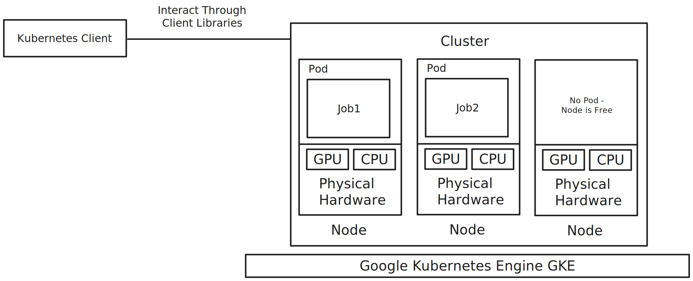

# Custom Kubernetes Client Wrapper

Custom Kubernetes client Wrapper for creating, deleting, and retrieving job status.

## Client Setup

1. Copy `kubeclient.py` to your working Directory
2. Install kubernetes packages `pip install kubernetes`
3. Import Client and Use Methods

```py
from kubeclient import CustomKubernetesClient

client = CustomKubernetesClient(
  config_file="/path/to/cluster/config-file"
)

# Create a Job
client.create_job(
  name="uuid - job id"
  image="path/to/training-job/image:tag"
  command=["python3", "training.py"]
  args=[]
)

# delete a job
client.delete_job("job name")

# Retrive Job Status
client.get_job_status("job name")
# Response = Literal['Succeeded', 'Failed', 'Started', 'Queued', 'Pending'] | None
```

**Note:** You do not need to set up kubernetes tools if the cluster is already up and running.



## Setting up Kubernetes Tools

Enable Container APIs if you haven't: `gcloud services enable container.googleapis.com`

1. Make sure to have `kubectl` installed.
2. Install gke plugin for kubectl `gcloud components install gke-gcloud-auth-plugin`

## Working with Kubernetes Cluster on GKE using `Kubectl`

| Argument                      | Description                                                                                                                                                                                                                      |
|-------------------------------|----------------------------------------------------------------------------------------------------------------------------------------------------------------------------------------------------------------------------------|
| `gpu-cluster-auto`            | The name of the Kubernetes cluster to be created.                                                                                                                                                                                |
| `--zone us-central1-f`        | Specifies the zone where the cluster will be located. This is a specific geographic location within a region.                                                                                                                    |
| `--num-nodes=1`               | Sets the number of nodes for the cluster's default node pool. In this case, it's set to 1 node.                                                                                                                                  |
| `--machine-type=n1-standard-4`| Defines the type of machine to use for the nodes. `n1-standard-4` means each node will have 4 virtual CPUs and 15 GB of memory.                                                                                                  |
| `--accelerator type="nvidia-tesla-t4,count=1,gpu-driver-version=default"` | Requests an NVIDIA Tesla T4 GPU to be attached to each node, with the default GPU driver version.                                                                                                                                |
| `--scopes`                    | Defines the set of Google Cloud Platform (GCP) service accounts permissions for the nodes. The listed scopes allow the cluster to interact with other GCP services like storage, logging, monitoring, etc.                        |
| `--min-nodes 1`               | The minimum number of nodes for the cluster's node pool. Autoscaling won't scale below this number.                                                                                                                              |
| `--max-nodes 10`              | The maximum number of nodes for the cluster's node pool. Autoscaling won't scale above this number.                                                                                                                              |
| `--enable-autoscaling`        | Enables the cluster to automatically adjust the number of nodes based on the workload.                                                                                                                                            |
| `--autoscaling-profile optimize-utilization` | Sets the autoscaling profile to 'optimize-utilization', which means the autoscaler will prioritize keeping the utilization high over keeping spare capacity.                                                                     |
| `--scale-down-unneeded-time "1m"` | Sets the amount of time a node must be underutilized before the autoscaler can remove it. In this case, it's set to 1 minute.                                                                                                    |

## The Importance of Setting the `devstorage.full_control` Scope for Write Access in Google Cloud Storage

It's crucial to highlight the scope `https://www.googleapis.com/auth/devstorage.full_control`. By default, the permissions for accessing Google Cloud Storage are set to read-only. However, if we want the applications running on our Kubernetes pods to be able to write data to Google Cloud Storage, we need to grant them more than just read permissions.

This is where the `devstorage.full_control` scope comes into play. By including this scope, we give the virtual machines (VMs) that make up our Kubernetes nodes the necessary permissions to write to Google Cloud Storage. This is a permission setting at the VM level, which is different from the permissions associated with a service account key file.

Even if the service account used by `gsutil` (a command-line tool for Google Cloud Storage) has all the required permissions to write to storage, the operation will fail if the VM itself doesn't have the write access granted. This is because the VM's scope acts as a gatekeeper, determining what the service account is allowed to do on that particular machine.

In summary, without setting the `devstorage.full_control` scope, our jobs running on the Kubernetes pods will not be able to write their results back to any storage, despite the service account's capabilities. Therefore, it's essential to explicitly define this scope to ensure that our applications have the necessary permissions to perform write operations on Google Cloud Storage.

### Create GKS Cluster

**Bash:**
```bash
gcloud container clusters create gpu-cluster-auto \
  --zone us-central1-f \
  --machine-type=n1-standard-4 \
  --accelerator type="nvidia-tesla-t4,count=1,gpu-driver-version=default" \
  --scopes "https://www.googleapis.com/auth/devstorage.full_control",\
"https://www.googleapis.com/auth/logging.write",\
"https://www.googleapis.com/auth/monitoring",\
"https://www.googleapis.com/auth/service.management.readonly",\
"https://www.googleapis.com/auth/servicecontrol",\
"https://www.googleapis.com/auth/trace.append" \
  --num-nodes 1 \
  --min-nodes 1 \
  --max-nodes 10 \
  --enable-autoscaling \
  --autoscaling-profile optimize-utilization \
  --scale-down-unneeded-time "1m"
```

**PowerShell:**
```powershell
gcloud container clusters create gpu-cluster-auto `
  --zone us-central1-f `
  --machine-type=n1-standard-4 `
  --accelerator type="nvidia-tesla-t4,count=1,gpu-driver-version=default" `
  --scopes "https://www.googleapis.com/auth/devstorage.full_control",`
"https://www.googleapis.com/auth/logging.write",`
"https://www.googleapis.com/auth/monitoring",`
"https://www.googleapis.com/auth/service.management.readonly",`
"https://www.googleapis.com/auth/servicecontrol",`
"https://www.googleapis.com/auth/trace.append" `
  --num-nodes 1 `
  --min-nodes 1 `
  --max-nodes 10 `
  --enable-autoscaling `
  --autoscaling-profile optimize-utilization `
  --scale-down-unneeded-time "1m"
```


### Retrieve Cluster to Kubectl

Get Cluster Credentials to interact with kubectl

```bash
gcloud container clusters get-credentials gpu-cluster --zone us-central-f
```

To view Clusters: `gcloud container clusters list`

To View the Nodes: `kubectl get nodes`

To View the Running Nodes: `kubectl get nodes`

To View the Running Pods: `kubectl get pods`

To View the Running Jobs: `kubectl get jobs`

To View the logs of a pod: `kubectl logs <pod name>`

To Connect to a Particular Pod: `kubectl exec -it <pod name> -- /bin/bash`

### Create Node Pool (Optional)

**Bash:**

```bash
gcloud container node-pools create gpu-pool-auto \
  --cluster=gpu-cluster-auto \
  --zone=us-central1-f \
  --machine-type=n1-standard-4 \
  --accelerator=type=nvidia-tesla-t4,count=1,gpu-driver-version=default \
  --scopes="https://www.googleapis.com/auth/devstorage.full_control",\
"https://www.googleapis.com/auth/logging.write",\
"https://www.googleapis.com/auth/monitoring",\
"https://www.googleapis.com/auth/service.management.readonly",\
"https://www.googleapis.com/auth/servicecontrol",\
"https://www.googleapis.com/auth/trace.append" \
  --num-nodes=1 \
  --min-nodes=1 \
  --max-nodes=10 \
  --enable-autoscaling \
  --autoscaling-profile=optimize-utilization \
  --scale-down-unneeded-time="1m"
```

**PowerShell:**

```powershell
gcloud container node-pools create gpu-pool-auto `
  --cluster=gpu-cluster-auto `
  --zone=us-central1-f `
  --machine-type=n1-standard-4 `
  --accelerator=type=nvidia-tesla-t4,count=1,gpu-driver-version=default `
  --scopes="https://www.googleapis.com/auth/devstorage.full_control",`
"https://www.googleapis.com/auth/logging.write",`
"https://www.googleapis.com/auth/monitoring",`
"https://www.googleapis.com/auth/service.management.readonly",`
"https://www.googleapis.com/auth/servicecontrol",`
"https://www.googleapis.com/auth/trace.append" `
  --num-nodes=1 `
  --min-nodes=1 `
  --max-nodes=10 `
  --enable-autoscaling `
  --autoscaling-profile=optimize-utilization `
  --scale-down-unneeded-time="1m"
```